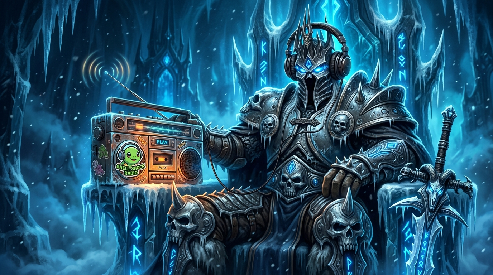

# Turtle WoW Radio for WoW 3.3.5a (Wrath of the Lich King)

<p align="center">
  
</p>

A lightweight, crash-safe client-side live audio streaming modification and in-game player for **World of Warcraft 3.3.5a (Wrath of the Lich King, build 12340)**.

Streams live 24/7 internet radio stations — including the official **Turtle WoW Everlook Broadcasting Co.** relays, chillhop, ambient, retro, vaporwave, and any custom Icecast, Shoutcast, MP3, AAC, and OGG streams — directly inside the game engine with independent volume control.

---

## Preset Stations Included

The player comes pre-configured with 6 curated live streaming stations:

| Station | Genre | Stream URL |
| :--- | :--- | :--- |
| **Everlook Relay 1 (TWoW)** | Turtle WoW Radio | `http://radiodirect.turtle-music.org/stream` |
| **Everlook Relay 2 (TWoW)** | Turtle WoW Radio (Backup) | `http://radiodirect2.turtle-music.org/stream` |
| **Nightwave Plaza** | Vaporwave / Future Funk | `http://radio.plaza.one/mp3` |
| **SomaFM Groove Salad** | Ambient / Downtempo | `http://ice1.somafm.com/groovesalad-128-mp3` |
| **Lofi Girl** | Chill Beats / Lo-Fi Hip Hop | `http://stream.zeno.fm/f3wvbbqmdg8uv` |
| **SomaFM Secret Agent** | Retro Spy / Lounge / Surf | `http://ice1.somafm.com/secretagent-128-mp3` |

---

## Features

- **Expanded In-Game Player Window (420 x 395):**
  - **One-Click Presets:** Instant tuning buttons for all 6 pre-configured stations.
  - **Custom Stream URL Input:** Paste any live web stream URL into the input field and hit Play.
  - **Auto-Pause on Minimize:** Automatically pauses radio audio when the game window is minimized and resumes immediately upon restoring the window (like native WoW game sound). Can be toggled via the checkbox in the UI or `/radio min`.
  - **Live Song Title Display:** Displays live track and artist metadata broadcasted by the station.
  - **Independent Volume Slider:** Adjust radio volume from 0% to 100% without altering master game sound.
  - **Draggable & Clean:** Movable window styled after the classic WoW interface with Goblin iconography.
- **Crash-Free Main-Thread Architecture (`dinput8.dll`):**
  - Uses an IAT hook on `USER32!PeekMessageA` inside `Wow.exe` so all Lua state queries and registrations occur synchronously on WoW's **main render thread**.
  - Eliminates thread concurrency issues and `Error #132 (0xC0000005)` crashes.
  - Seamlessly re-registers Lua functions across character switches, zone transfers, and `/reload`.
  - Generates `radio_debug.log` in the game folder for instant status verification.
- **100% Client-Side:** Works on any 3.3.5a server (AzerothCore, TrinityCore, Warmane, vMaNGOS, etc.). Zero server patches or server-side scripts required.

---

## Installation in 3 Steps

### Step 1: Copy the DLLs to your WoW Game Folder
Copy the following two files into your WoW game root directory (where `Wow.exe` is located):
- `dinput8.dll` *(DirectInput 8 proxy DLL)*
- `bass.dll` *(BASS 2.4 32-bit audio engine)*

### Step 2: Install the In-Game Addon
Copy the `AddOns/ServerRadio` folder into your game's AddOns directory:
- Destination: `<Your WoW Folder>\Interface\AddOns\ServerRadio\`

### Step 3: Launch & Play
1. Start `Wow.exe`.
2. At the Character Selection screen, click **AddOns** in the bottom-left corner and ensure **Server Radio** is checked (check *Load out of date AddOns* if needed).
3. Enter the game and type `/radio` or `/stream` to open the player.
4. Click any station button or enter a custom stream URL, then press **Play**!

---

## In-Game Controls & Commands

| Slash Command | Action |
| :--- | :--- |
| `/radio` or `/stream` | Opens / closes the Radio Player window |
| `/radio play` | Starts streaming the currently selected station |
| `/radio stop` | Stops streaming audio |
| `/radio min` | Toggles auto-pause when game window is minimized |
| `/radio vol <0-100>` | Sets volume directly (e.g. `/radio vol 50`) |

---

## Adding Custom Preset Stations

You can easily customize the preset list by editing:
`Interface\AddOns\ServerRadio\ServerRadio.lua`

Find the `STATIONS` table at the top of the file:
```lua
local STATIONS = {
    { name = "Everlook Relay 1 (TWoW)", url = "http://radiodirect.turtle-music.org/stream" },
    { name = "Everlook Relay 2 (TWoW)", url = "http://radiodirect2.turtle-music.org/stream" },
    { name = "Nightwave Plaza (Vaporwave)", url = "http://radio.plaza.one/mp3" },
    { name = "SomaFM Groove Salad (Ambient)", url = "http://ice1.somafm.com/groovesalad-128-mp3" },
    { name = "Lofi Girl (Chill Beats)", url = "http://stream.zeno.fm/f3wvbbqmdg8uv" },
    { name = "SomaFM Secret Agent (Retro)", url = "http://ice1.somafm.com/secretagent-128-mp3" },
    { name = "My Custom Station", url = "http://my-stream.example.com:8000/live.mp3" },
}
```

Save the file and run `/reload` in-game.

---

## Verification & Debug Log

When `Wow.exe` runs, `dinput8.dll` writes diagnostic output to **`radio_debug.log`** in the game directory:
```text
=== Radio Proxy DLL Attached to Process ===
BASS initialized successfully.
Found Wow.exe base at 0x...
Successfully hooked USER32.dll!PeekMessageA via Wow.exe IAT.
SUCCESS: Registered Radio Lua functions on MAIN THREAD for state 0x...
```

---

## License & Credits

- Audio streaming powered by the [BASS Audio Library](https://www.un4seen.com/).
- Special thanks to the Turtle WoW community and Everlook Broadcasting Co. for 24/7 in-game radio broadcasts.
